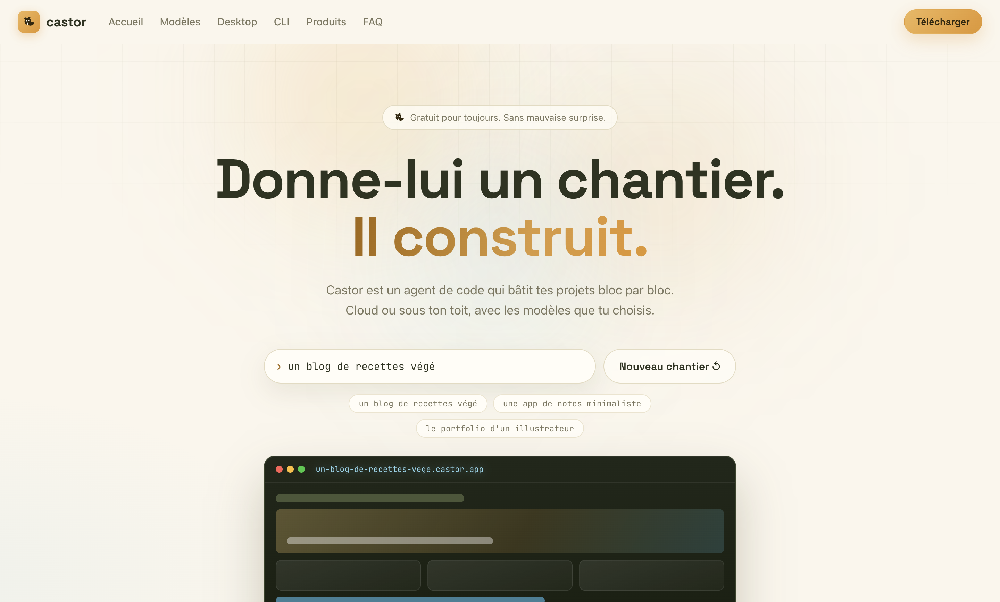
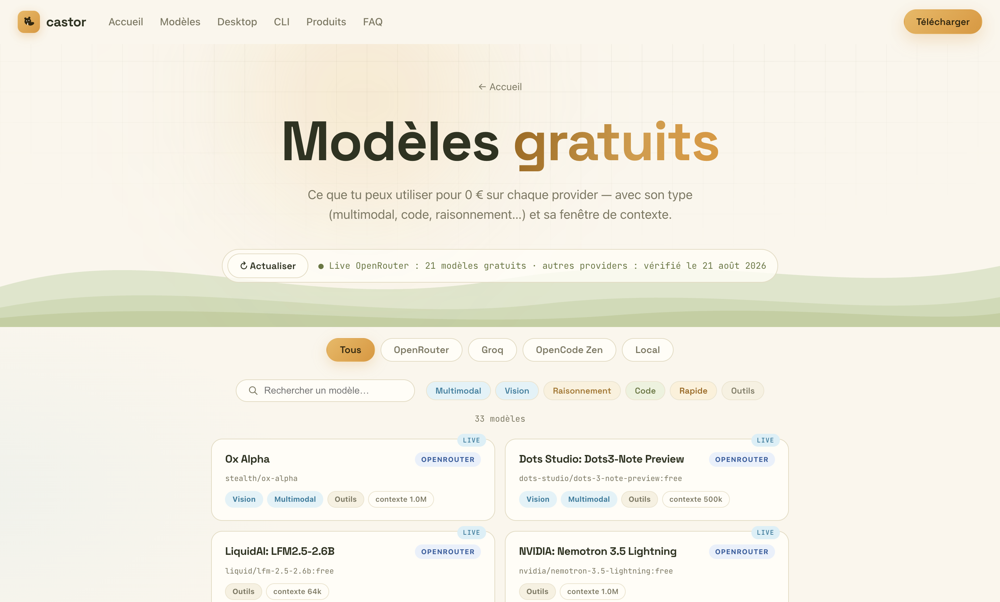
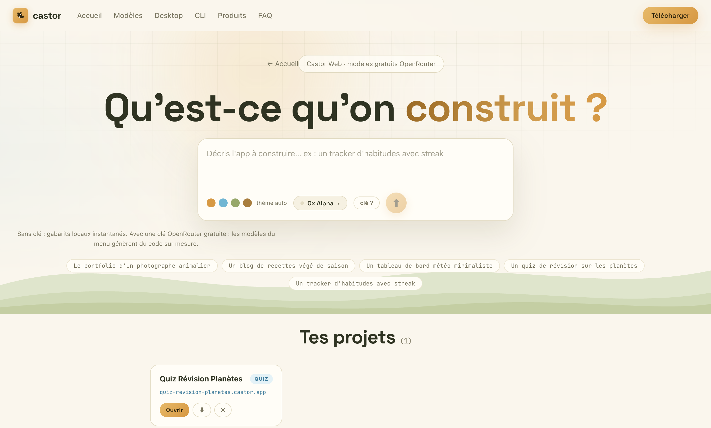
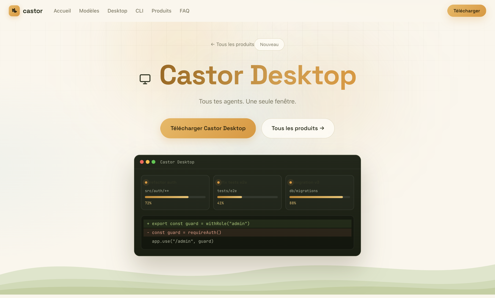

<div align="center">


# Castor

**Le castor qui code pour toi. Gratuit pour toujours.**

Site vitrine · studio de création web · app Desktop multi-providers · CLI

[](https://react.dev)
[](https://electronjs.org)
[](https://vitejs.dev)
[](https://nodejs.org)
[](LICENSE)
[](#)
[](https://github.com/DmzGamingYT/castor/releases/latest)
[](https://github.com/DmzGamingYT/castor/stargazers)
[](https://github.com/DmzGamingYT/castor/issues)

</div>

---

**Castor** est un projet complet autour d'un agent de code gratuit :

- un **site vitrine** bilingue (FR/EN) au thème « papier & encre » avec un hero interactif où le castor bâtit une app sous tes yeux,
- une **section Avancement** : la roadmap vivante du projet — anneaux de progression, kanban par catégorie, suivi temps réel des chantiers livrés,
- un **Castor Bot 24/7** : assistant embarqué sur le site (et dans l'app Desktop) qui connaît la roadmap par cœur — mode local même sans clé,
- une **page Espace Cloud** : sandbox essayable dans le navigateur — branche un repo GitHub réel ou génère un projet sur mesure,
- une **page Templates** : points de départ générés par Castor (blog, portfolio, dashboard, landing, e-commerce, SaaS),
- une **page CLI interactive** : essaie l'agent dans un terminal en ligne, avec historique et autocomplétion,
- une **CLI zéro dépendance** : l'agent dans ton terminal — streaming, compétences `/`, mémoire persistante, plans de tâches,
- une **app Desktop** (Windows / macOS / Linux) qui branche OpenRouter, Groq, OpenCode Zen et tes modèles locaux — agents parallèles, diff côte à côte, serveurs MCP, thèmes personnalisables.

---

## 📑 Table des matières

- [Aperçus](#aperçus)
- [Fonctionnalités](#fonctionnalités)
  - [Site vitrine](#site-vitrine)
  - [App Desktop](#app-desktop)
  - [CLI](#cli)
- [Démarrage rapide](#démarrage-rapide)
- [Providers](#providers)
- [Sécurité](#sécurité)
- [Structure](#structure)
- [Installer & désinstaller](#installer--désinstaller)
- [Notes de packaging](#notes-de-packaging)
- [Roadmap](#roadmap)
- [Licence](#licence)

---

## Aperçus

| Accueil — le chantier | Modèles gratuits |
| --- | --- |
|  |  |

| Studio Web | Page Desktop |
| --- | --- |
|  |  |

## Fonctionnalités

<details>
<summary><strong>🌐 Site vitrine</strong></summary>

<br>

- **Hero « Le Chantier »** : écris un chantier, regarde l'app se construire bloc par bloc avec son journal de bord
- **Bilingue FR/EN** : tout le site, les studios et le Castor Bot sont traduits — détection de langue automatique
- **Section Avancement** : anneaux de progression animés, kanban par catégorie (livré / en cours / bientôt / exploration), répartition visuelle, panneau temps réel des chantiers livrés
- **Castor Bot 24/7** : assistant discret sur toutes les pages — roadmap, aide, astuces ; moteur hybride (base de connaissances locale + LLM via OpenRouter si tu branches une clé), il répond **même hors ligne**
- **Page Espace Cloud** : sandbox essayable — vérifie un repo GitHub réel via l'API publique, ou décris un projet et regarde l'agent le construire étape par étape
- **Page Templates** : points de départ générés (blog, portfolio, dashboard, landing, e-commerce, SaaS) — un clic remplit le composeur
- **Page CLI interactive** : terminal en ligne avec historique (↑/↓), autocomplétion (Tab), palette de commandes et stats de session
- Thème clair « papier & encre », icônes SVG dessinées main, zéro framework CSS

</details>

<details>
<summary><strong>🖥️ App Desktop</strong></summary>

<br>

- **Multi-providers** via le protocole OpenAI-compatible : OpenRouter · Groq · OpenCode Zen · Ollama · LM Studio
- **Agents parallèles** : plusieurs agents en même temps, chacun dans son panneau isolé
- **Streaming token par token**, arrêt à la volée (Échap), stats : latence, tok/s, premier token, ↑↓ tokens
- **Agents planifiés** : lance un refactor chaque nuit à 2h — quotidien, horaire ou par intervalle, avec notifications et historique
- **Diff côte à côte** : compare avant/après en split view, valide hunk par hunk, applique partiellement
- **Serveurs MCP** : branche des outils externes (base de données, Figma, docs) via le protocole MCP
- **Command palette `Cmd+K`**, onboarding en 3 étapes, undo avec backup sur chaque écriture, drag & drop de fichiers
- **Compétences `/`** : tes prompts réutilisables (`/review`, `/tests`… ou les tiens), menu filtrable au clavier
- **Mémoire persistante** : des faits injectés dans chaque requête, qui survivent aux redémarrages
- **Plan de tâches live** : la checklist du modèle devient une todo avec barre de progression
- **Jauge de contexte** : remplissage estimé de la fenêtre 128k en temps réel
- **Onglet Files** : explorateur du chantier (filtre, dossiers dépliables, aperçu lecture seule)
- **Markdown enrichi** : titres, listes, liens et coloration syntaxique maison dans les réponses
- **Thèmes personnalisables** : 5 presets + color picker libre (variable CSS `--accent`)
- **Synchronisation multi-postes** : export/import JSON de tes conversations, clés et réglages
- **Fenêtre glissante** : sur les longues conversations, seuls les ~75 % récents de la fenêtre sont envoyés (les 2 derniers messages toujours conservés) — ça ne déborde jamais
- Clés API **chiffrées** via `safeStorage` du système · icône et thème maison · packaging DMG / NSIS / AppImage

</details>

<details>
<summary><strong>⌨️ CLI</strong></summary>

<br>

```bash
cd cli && npm link        # ou : node bin/castor.js
castor                    # session interactive
castor -p "explique ce fichier"   # one-shot
```

| Commande | Effet |
| --- | --- |
| `/provider [id]` · `/model [id]` | changer de provider / modèle (liste live des gratuits) |
| `/key <clé>` | enregistrer la clé du provider courant |
| `/skills` · `/skill <nom>` | prompts réutilisables, activables une demande |
| `/remember <fait>` · `/forget <motif>` | mémoire persistante (`~/.castor/memory.json`) |
| `/todo` · `/usage` | dernier plan · tokens cumulés |
| `/demo` | rendu hors-ligne complet, **sans aucune clé** |

Le prompt système injecte automatiquement mémoire, compétence active, date et contexte ; les plans multi-étapes (`- [ ]`) sont extraits et affichés en checklist.

</details>

## Démarrage rapide

Prérequis : **Node 18+**

```bash
# le site + studio
npm install
npm run dev            # → http://localhost:5173

# l'app Desktop
cd desktop
npm install
npm start              # lance Castor Desktop

# empaqueter l'app (icônes incluses)
npm run dist:dir       # build non signé local
npm run dist           # DMG (mac) · NSIS (win) · AppImage/deb (linux)

# la CLI
cd cli
npm link               # commande `castor` globale
castor                 # session interactive · /demo pour essayer sans clé
```

<details>
<summary><strong>🔧 Commandes utiles (dev)</strong></summary>

<br>

> Générer l'icône après modification : `npx electron scripts/make-icon.cjs`
> Capturer les écrans du README : `npx electron scripts/capture.cjs` (dev server requis)
> Tests site : `npm test` (Vitest) · Tests Desktop : `cd desktop && npm test` · Tests CLI : `cd cli && npm test`

</details>

## Providers

| Provider | Clé requise | Particularité |
| --- | --- | --- |
| **OpenRouter** | oui (gratuit) | 400+ modèles, tier `:free`, endpoint éditable |
| **Groq** | oui (gratuit) | inférence LPU ultra-rapide |
| **OpenCode Zen** | oui | passerelle spécialisée code |
| **Ollama** | non | 100 % local, hors ligne |
| **LM Studio** | non | serveur local, modèles détectés auto |

## Sécurité

- Clés Desktop chiffrées par le coffre de l'OS (`safeStorage`), jamais en clair sur le disque
- Clé du studio Web conservée uniquement dans le `localStorage` de ton navigateur
- Aucune donnée envoyée ailleurs qu'aux providers que tu choisis

## Structure

```
castor/
├── index.html               # site (Vite + React)
├── src/
│   ├── pages/               # accueil, espace cloud, cli, templates, avancement, produits
│   ├── components/          # UI (DamScene, ProjectProgress, CastorBot, DownloadModal…)
│   ├── data/                # produits, roadmap, catalogue de modèles, plateformes
│   └── lib/                 # generator, openrouter, translations (FR/EN), chatEngine
├── scripts/                 # capture.cjs (screenshots), audit
├── tests/                   # tests Vitest du site
├── cli/                     # Castor CLI — zéro dépendance, Node 18+
│   ├── bin/castor.js        # REPL, one-shot -p, commandes slash
│   ├── lib/                 # providers, store (~/.castor), rendu ANSI, onboarding
│   └── tests/               # tests node:test de la CLI
└── desktop/
    ├── main.js              # fenêtre, IPC, streaming SSE, coffre à clés, scheduler, MCP
    ├── preload.js           # pont sécurisé (contextIsolation)
    ├── src/providers.js     # registre des providers
    ├── scripts/make-icon.cjs# icône générée par rendu Chromium
    ├── tests/               # tests node:test du Desktop
    └── renderer/            # UI Desktop (même DA que le site)
```

<details>
<summary><strong>📦 Installer & désinstaller</strong></summary>

<br>

Chaque OS a un **installateur propre** (recommandé) et des **versions portables** :

| OS | Installer (recommandé) | Portable | Désinstallation |
| --- | --- | --- | --- |
| Windows | `Castor-Windows-*-setup.exe` (NSIS : raccourcis, choix du dossier) | zip | **Paramètres → Applications → « Castor Desktop » → Désinstaller** (ou `scripts/uninstall-windows.ps1` pour le portable) |
| macOS | `Castor-macOS-arm64.dmg` (glisser-déposer) | zip | `bash desktop/scripts/uninstall-macos.sh` (retire app + réglages + clés) |
| Linux | `Castor-Linux-arm64.deb` | AppImage / tar.gz | `sudo apt remove castor-desktop` ou `bash desktop/scripts/uninstall-linux.sh` |

Builds **arm64 + x64** attachées automatiquement à la Release GitHub à chaque tag `v*` (workflow `.github/workflows/release.yml`). La modale du site détecte ta plateforme et ton architecture pour présélectionner le bon fichier.

</details>

<details>
<summary><strong>📝 Notes de packaging</strong></summary>

<br>

- macOS : builds **non notarisées** (compte Developer requis) — premier lancement via *Réglages → Confidentialité et sécurité → Ouvrir même ainsi*, ou `xattr -cr /Applications/Castor.app`
- L'icône (carré crème + 7 lignes, style « papier & encre ») est générée sans dépendance : `python3 desktop/scripts/gen-icon.py` → `desktop/build/icon.{png,icns,ico,svg}`
- Le désinstalleur NSIS retire aussi `%APPDATA%\castor-desktop` (réglages, mémoire, clés) ; sur macOS/Linux, les scripts font pareil
- La modale de téléchargement pointe vers `releases/latest/download` ; le dossier local `public/downloads/` sert uniquement de cache en dev

</details>

## Roadmap

> La source de vérité est [`src/data/roadmap.js`](src/data/roadmap.js) — la page [Avancement](#aperçus) du site et le Castor Bot la lisent directement. Statuts : ✅ livré · 🔨 en cours · 🚀 bientôt · 🔬 exploration.

**📱 App Desktop**
- [x] Agents planifiés · Diff côte à côte · Assistant IA embarqué · Sync multi-postes · Serveurs MCP · Thèmes personnalisables
- [ ] 🔨 Git intégré · Mise à jour automatique
- [ ] 🚀 Recherche globale · Mode sandbox
- [ ] 🔬 Version anglaise de l'app

**🌐 Site**
- [x] Page CLI dédiée
- [ ] 🔨 Templates de projets · Version anglaise (i18n en place, complétion des traductions)
- [ ] 🚀 Éditeur visuel du Studio Web · Galerie de créations
- [ ] 🔬 PWA & installation mobile · Blog Castor

**🧠 Modèles**
- [ ] 🔨 Benchmarks hebdo
- [ ] 🚀 Sélection auto du modèle · Vision dans Desktop
- [ ] 🔬 Profils de contexte long

## Licence

[MIT](LICENSE) — fais-en ce que tu veux, avec un petit crédit fait plaisir.

<div align="center">

<br/><sub>Bâti avec 🦫 · 0 € pour toujours</sub>
</div>
